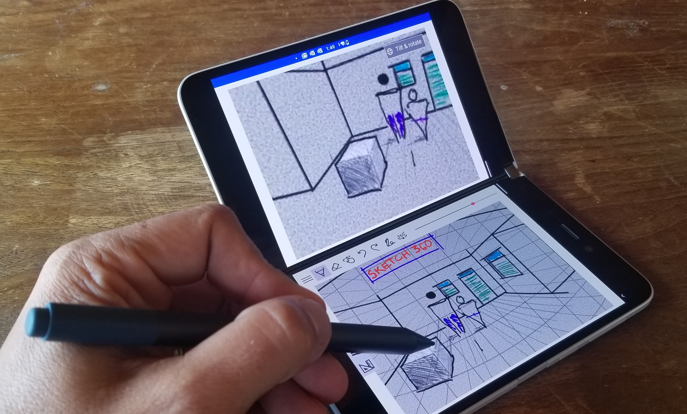

# Sketch 360: a Microsoft Garage Project
A Cross Platform 360 Degree Panoramic Sketching App

- Install from the [Google Play Marketplace](https://play.google.com/store/apps/details?id=com.microsoft.garage.sketch360app)
- Install from the [Microsoft Store](https://www.microsoft.com/en-us/p/sketch-360/9p89s2qlh11t)

Sketch 360 was built by [Michael Scherotter](https://github.com/mscherotter) and 
[originally released](https://www.microsoft.com/en-us/garage/blog/2018/11/finally-a-way-to-sketch-360-degree-vr-scenes/) 
as a Microsoft Garage project in 2018 as a UWP app for Microsoft Windows and is available today for free in the
[Microsoft Store](https://www.microsoft.com/en-us/p/sketch-360/9p89s2qlh11t).  This is a new version of Sketch 
360 built to take advantage of pen-enabled devices that have two screens like the 
[Microsoft Surface Duo](https://www.microsoft.com/en-us/surface/devices/surface-duo) but it should work on most 
Android devices as well.

## Examples of Sketches created with Sketch 360
- [360 Drawings](https://lightroom.adobe.com/shares/21b9e652ff4e46ef86130478cbb50abf)
- [360 Videos](https://studio.youtube.com/video/AImRmQYN_hk/edit)
- [Virtual Flight 360 Sketch](https://youtu.be/pTFVXD1v3zQ)
## Sketch 360 on the Microsoft Surface Duo

## Platforms
Platform | Status
-------- | ------------
Android  | Complete with enhancements for Microsoft Surface Duo (dual screen & pressure-sensitive pen support) 
iOS      | Runs but pen/touch interactivity does not work yet.
Windows  | In-progress but not prioritized as the native Windows version is already available.

## Technology
- [Xamarin Forms](https://docs.microsoft.com/en-us/xamarin/xamarin-forms/)
- [SkiaSharp](https://github.com/mono/SkiaSharp)
- [Babylon JS](https://www.babylonjs.com/)

## Contributing
[How to contribute](Contributing.md)

[Open Source Code of Conduct](https://opensource.microsoft.com/codeofconduct)

## Trademarks
This project may contain trademarks or logos for projects, products, or services. Authorized use of Microsoft trademarks or logos is subject to and must follow Microsoft's Trademark & Brand Guidelines. Use of Microsoft trademarks or logos in modified versions of this project must not cause confusion or imply Microsoft sponsorship. Any use of third-party trademarks or logos are subject to those third-party's policies.

## Data Collection
[Data collection information](DataCollection.md)

## Security Reporting
[Report secuirty vulnerabilities here](Security.md).

## Microsoft Garage
Sketch 360 is a Microsoft Garage project. The Microsoft Garage turns fresh ideas into real projects. Learn more about The Garage at: http://microsoft.com/garage.